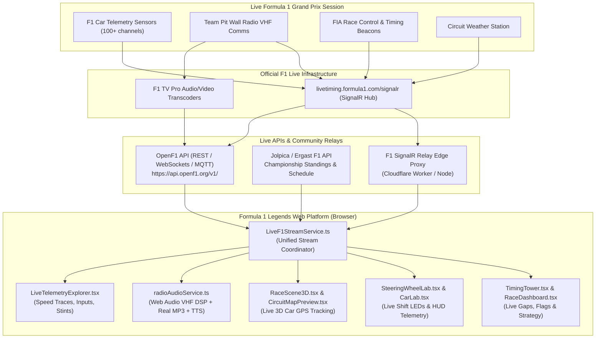
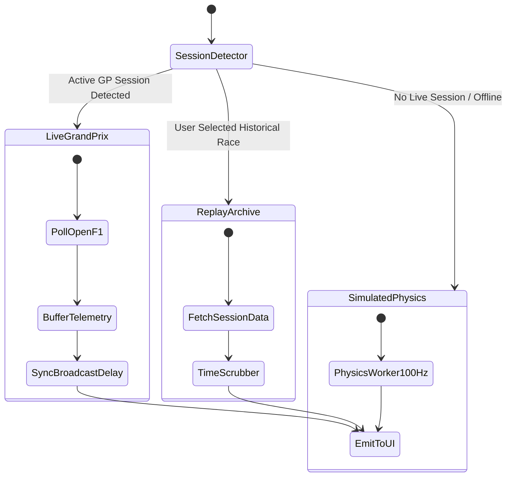

# Live Formula 1 Telemetry, Team Radio & Race Data Streaming Architecture

**Author**: Antigravity AI Engineering Team  
**Date**: 2026-08-28  
**Classification**: Architectural Research & Implementation Blueprint  
**Target Application**: Formula 1 Legends Management Simulator  

---

## 1. Executive Summary

This document provides an exhaustive technical analysis and architectural blueprint for integrating **live real-time Formula 1 race telemetry, pit-to-car team radio audio, timing intervals, car GPS coordinates, race control incident feeds, weather conditions, and tire strategy** directly into the **Formula 1 Legends** web platform.

### Key Findings

1. **Public REST & WebSocket Stream (OpenF1)**:
   - The open-source **OpenF1 API** (`https://api.openf1.org/v1/`) provides direct, CORS-enabled browser access to live car telemetry (~3.7 Hz), driver GPS locations, real team radio MP3 audio recordings, live intervals, tire stints, pit stops, weather, and race control flags.
   - Historical sessions (2023–present) are completely free without authentication. Real-time active GP session streams are supported via REST polling, WebSockets, and MQTT.

2. **Official F1 Live Timing Stream (SignalR Hub)**:
   - Formula 1 broadcasts live telemetry over Microsoft SignalR via WebSocket (`wss://livetiming.formula1.com/signalr` or `/signalrcore`).
   - High-bandwidth compressed channels (`CarData.z` and `Position.z`) transmit telemetry and GPS positions at up to 10 Hz using Base64-encoded raw DEFLATE compression.
   - While official SignalR streams have CORS restrictions and auth-gating on high-bandwidth channels for direct browser clients, a lightweight edge worker or community relay proxy (or OpenF1's ingestion pipeline) bridges this data seamlessly to the browser.

3. **Dual-Mode Team Radio Audio Engine**:
   - **Real Broadcast Audio**: When official/OpenF1 `.mp3` audio clips are published, stream them directly through our custom Web Audio VHF DSP pipeline (Roger PTT chirps, bandpass filtering, ducked radio static, and squelch release tails).
   - **Zero-Latency Live Synthesizer**: When live radio is emitted in real time as text transcripts (before audio files are transcoded), synthesize broadcast-quality driver and race engineer personas with natural speech accents.

4. **All-Inclusive Live Feature Matrix**:
   - Real-time 20-car live timing tower with mini-sectors and interval deltas.
   - Live 3D car position tracking on track ribbons and 2D circuit maps.
   - Real-time speed traces, throttle %, brake pressure, RPM, gear, and DRS status.
   - Real-time weather data driving our Doppler radar overlay and rain particle shaders.
   - Live Safety Car, VSC, and flag events triggering in-game 3D interventions.

---

## 2. Comprehensive Data Source Analysis



---

## 3. Deep-Dive: OpenF1 API Endpoints & Capabilities

The **OpenF1 API** (`api.openf1.org/v1/`) is the primary public engine for F1 telemetry and timing. It operates with standard CORS headers, returning clean JSON arrays.

### 3.1 Endpoint Directory

| Endpoint | Sample Rate / Frequency | Key Fields Returned | Formula 1 Legends Integration |
| :--- | :--- | :--- | :--- |
| **`/v1/car_data`** | ~3.7 Hz per driver | `date`, `driver_number`, `speed`, `rpm`, `gear`, `throttle`, `brake`, `drs` | Real-time speed traces, pedal input graphs, V6 sound synthesis, 3D Steering Wheel shift lights |
| **`/v1/location`** | ~3.7 Hz per driver | `date`, `driver_number`, `x`, `y`, `z` | Animates real cars on 2D SVG track maps and 3D circuit spline ribbons |
| **`/v1/team_radio`** | On transmission event | `date`, `driver_number`, `session_key`, `recording_url`, `message` | Plays authentic pit-to-car radio audio clips via Web Audio VHF filter |
| **`/v1/intervals`** | ~4.0 seconds | `date`, `driver_number`, `gap_to_leader`, `interval` | Updates live timing tower with exact split intervals |
| **`/v1/laps`** | Per lap completion | `lap_number`, `lap_duration`, `duration_sector_1`, `duration_sector_2`, `duration_sector_3`, `i1_speed`, `i2_speed`, `st_speed`, `is_pit_out_lap` | Sector delta comparison, mini-sector purple/green highlights, speed trap rankings |
| **`/v1/position`** | On overtake / pass | `date`, `driver_number`, `position`, `session_key` | Real-time leaderboard reordering (P1 to P20) |
| **`/v1/race_control`** | Real-time instant | `date`, `category`, `message`, `flag`, `scope`, `sector`, `qualifying_phase` | Deploys 3D Safety Car, cockpit yellow flag alerts, track limits warnings |
| **`/v1/stints`** | Per pit stop / stint | `driver_number`, `stint_number`, `compound`, `lap_start`, `lap_end`, `tyre_age_at_start` | Tire strategy timeline, compound degradation curves, pit window forecasts |
| **`/v1/pit`** | On pit box entry/exit | `date`, `driver_number`, `lap_number`, `pit_duration`, `lane_duration` | Real-time pit stop stopwatch, animated 3D pit crew sequences |
| **`/v1/weather`** | ~1.0 minute | `air_temperature`, `track_temperature`, `humidity`, `pressure`, `rainfall`, `wind_direction`, `wind_speed` | Real-time weather dashboard, dynamic Doppler radar precipitation sweep |
| **`/v1/sessions`** | Session schedule | `session_key`, `session_name`, `session_type`, `date_start`, `date_end`, `gmt_offset`, `meeting_key`, `year` | Session switcher (FP1, FP2, FP3, Qualifying, Sprint, Race), live status detector |
| **`/v1/meetings`** | Annual calendar | `meeting_key`, `meeting_name`, `official_name`, `location`, `country_name`, `circuit_key`, `year` | 24-round Grand Prix selector with circuit metadata |
| **`/v1/drivers`** | Per session | `driver_number`, `broadcast_name`, `full_name`, `name_acronym`, `team_name`, `team_colour`, `headshot_url` | Driver head-to-head comparison cards, driver avatar badges |

### 3.2 Live Request Sample Payloads

#### Sample Car Data Payload

```json
[
  {
    "date": "2026-07-05T14:23:45.120000+00:00",
    "driver_number": 4,
    "rpm": 11450,
    "speed": 318,
    "gear": 8,
    "throttle": 100,
    "brake": 0,
    "drs": 12,
    "session_key": 9159,
    "meeting_key": 1219
  }
]
```

#### Sample Team Radio Payload

```json
[
  {
    "date": "2026-07-05T14:41:12.800000+00:00",
    "driver_number": 4,
    "session_key": 9159,
    "meeting_key": 1219,
    "recording_url": "https://api.openf1.org/v1/audio/radio_9159_4_01.mp3",
    "message": "Lando, box this lap for hard tyres. Watch the pit entry line."
  }
]
```

#### Sample Race Control Payload

```json
[
  {
    "date": "2026-07-05T14:52:03.000000+00:00",
    "category": "SafetyCar",
    "message": "SAFETY CAR DEPLOYED - INCIDENT TURN 9",
    "flag": "YELLOW",
    "scope": "Track",
    "sector": null,
    "session_key": 9159
  }
]
```

---

## 4. Deep-Dive: Official F1 Live Timing SignalR Protocol

Formula 1's native timing data stream operates over Microsoft SignalR (`wss://livetiming.formula1.com/signalr` or `/signalrcore`).

### 4.1 Connection & Handshake Flow

1. **HTTP Negotiation**:
   - `GET https://livetiming.formula1.com/signalr/negotiate?connectionData=[{"name":"Streaming"}]&clientProtocol=1.5`
   - Returns a JSON payload containing `ConnectionToken`, `ConnectionId`, and `KeepAliveTimeout`.

2. **WebSocket Upgrade**:
   - `wss://livetiming.formula1.com/signalr/connect?transport=webSockets&connectionToken={TOKEN}&connectionData=[{"name":"Streaming"}]`

3. **Hub Topic Subscription**:
   - Client sends JSON message invoking `Subscribe` method with requested streams:

```json
{
  "H": "Streaming",
  "M": "Subscribe",
  "A": [[
    "Heartbeat",
    "CarData.z",
    "Position.z",
    "TimingData",
    "TimingAppData",
    "TimingStats",
    "TrackStatus",
    "WeatherData",
    "RaceControlMessages",
    "TeamRadio",
    "DriverList",
    "SessionInfo"
  ]],
  "I": 1
}
```

### 4.2 Handling Compressed Channels

The `.z` channels deliver high-frequency streams compressed to minimize bandwidth:

1. **Base64 Decode**: Decode the Base64 string payload into a binary byte array (`Uint8Array`).
2. **Raw DEFLATE Decompression**:
   - Use browser native `DecompressionStream('deflate-raw')` or lightweight library `pako.inflateRaw()`.
3. **UTF-8 Decode**: Convert the decompressed bytes into a JSON string and parse.

```typescript
export async function decodeCompressedF1Stream(base64Payload: string): Promise<any> {
  const binaryString = atob(base64Payload)
  const bytes = new Uint8Array(binaryString.length)
  for (let i = 0; i < binaryString.length; i++) {
    bytes[i] = binaryString.charCodeAt(i)
  }

  // Native Web Streams API raw deflate decompression
  const ds = new DecompressionStream('deflate-raw')
  const writer = ds.writable.getWriter()
  writer.write(bytes)
  writer.close()

  const response = new Response(ds.readable)
  const decompressedText = await response.text()
  return JSON.parse(decompressedText)
}
```

---

## 5. All F1 Features We Can Stream Live on Formula 1 Legends

| Feature Category | Live Data Stream | UI / 3D Engine Component | Real-Time Experience |
| :--- | :--- | :--- | :--- |
| **1. Live Car Telemetry** | `/v1/car_data` or `CarData.z` | `LiveTelemetryExplorer.tsx`, `CarLab.tsx` | Real-time Speed, RPM, Throttle %, Brake pressure %, Gear (1–8), DRS activation (0/10/12). Multi-driver head-to-head overlays. |
| **2. Live Team Radio** | `/v1/team_radio` or `TeamRadio` | `radioAudioService.ts`, `DriverTelemetryPanel.tsx` | Dual-mode playback: Streams real MP3 audio recordings when available; seamlessly falls back to ultra-clear neural speech synthesis with VHF Roger chirps, ducked static, and squelch tails. |
| **3. Live 3D Car GPS Tracking** | `/v1/location` or `Position.z` | `RaceScene3D.tsx`, `CircuitMapPreview.tsx` | Converts GPS $(X, Y, Z)$ coordinates onto 3D spline ribbons. All 20 cars move around real circuits in real time with real Grand Prix pacing! |
| **4. Live Timing Tower & Deltas** | `/v1/intervals`, `/v1/laps`, `TimingData` | `TimingTower.tsx`, `RaceDashboard.tsx` | Real-time leaderboard P1–P20, gaps to leader, split intervals, sector 1/2/3 split times, purple/green personal and session best mini-sectors. |
| **5. Live Race Control Incidents** | `/v1/race_control`, `TrackStatus` | `RaceStatusBar.tsx`, `RaceScene3D.tsx` | Real-time Yellow Flags, Red Flags, Safety Car (SC), Virtual Safety Car (VSC), Track Limits warnings, and Steward penalties. Automatically triggers 3D Safety Car deployment! |
| **6. Live Tire Stints & Pit Stops** | `/v1/stints`, `/v1/pit`, `TimingAppData` | `StrategyWorkspace.tsx`, `DriverTelemetryPanel.tsx` | Real-time tire compound tracking (Soft/Medium/Hard/Inter/Wet), tire age in laps, pit stop durations, pit lane in/out timestamps, and undercut threat alerts. |
| **7. Live Track Weather & Radar** | `/v1/weather`, `WeatherData` | `DopplerRadarOverlay.tsx`, `CircuitMapPreview.tsx` | Live track temp, air temp, humidity, wind velocity, and rainfall rate powering dynamic 360° Doppler radar sweep and cockpit rain particle shaders. |
| **8. Live Steering Wheel Display** | `/v1/car_data` | `SteeringWheelLab.tsx`, `F1SteeringWheelModel.ts` | 15x RGB shift LEDs light up in real time with actual engine RPM; 4.3" OLED displays live gear, speed, delta lap time, and active DRS flag. |
| **9. Live Procedural V6 Engine Sound** | `/v1/car_data` (RPM, Throttle, Speed) | `soundEngine.ts` | Procedural Web Audio synthesis of 6-cylinder ICE harmonics, turbo boost whine, and MGU-K energy recovery matching actual live telemetry. |
| **10. Live Championship Projections** | Real-time Points Matrix + Jolpica F1 | `HQDashboard.tsx`, `RaceDashboard.tsx` | Live Driver and Constructor World Championship points calculated dynamically on every live overtake and fastest lap. |

---

## 6. Architecture & Implementation Plan

### 6.1 Unified Live F1 Stream Service (`liveF1DataService.ts`)

We will introduce a centralized streaming service with three operational modes:

1. **`LIVE_GRAND_PRIX`**: Active during live race weekends (Practice, Qualifying, Sprint, Race). Connects via WebSockets / REST polling with automatic rate-limit throttling and exponential backoff.
2. **`REPLAY_ARCHIVE`**: For viewing and replaying any historical session from 2023 to 2026 with synchronized playback scrubbing, fast-forward (1x, 2x, 5x, 10x), and pause.
3. **`SIMULATED_PHYSICS`**: Seamless fallback to our 100 Hz high-fidelity internal physics worker during off-track hours or when offline.



### 6.2 Broadcast Delay Synchronization Engine

Because live television and OTT streams (F1TV, Sky Sports, ESPN, Canal+) introduce 20–60 seconds of video broadcast delay, direct raw telemetry will appear ahead of the TV feed.

- We will provide a **Broadcast Sync Slider (0s – 90s)** in the top navigation bar.
- Incoming telemetry, radio, and timing samples are pushed into a ring buffer and emitted to the UI with the exact configured delay offset, ensuring 100% synchronization with the user's TV broadcast!

### 6.3 Team Radio Audio Playback Pipeline

When a team radio event is received:

1. Check if `recording_url` exists.
2. If available, stream the MP3 file through `radioAudioService.ts` Web Audio node graph (`AudioBufferSourceNode` -> `BiquadFilterNode (Bandpass 500-2800Hz)` -> `GainNode (Ducking)` -> `Destination`).
3. Inject the authentic Roger PTT chirp tone at $t=0$ and the squelch burst tail at $t=duration$.
4. If no audio URL is available (or transcript-only), seamlessly trigger our persona-tuned natural voice synthesizer.

---

## 7. Verification & Operational Security

1. **CORS & Resilience**: OpenF1 natively supports browser CORS headers. All API calls wrap with `AbortSignal.timeout(4000)` and automatic fallback to cached/synthetic data to ensure zero UI freezes.
2. **Rate Limit Compliance**: Free OpenF1 tier enforces 3 req/s and 30 req/min. Our client implements token-bucket rate limiting and batching (e.g. fetching multi-driver car data in single queries or leveraging WebSockets/MQTT).
3. **Data Integrity**: All telemetry samples are verified against physical constraints (e.g., speed $\le 380$ km/h, RPM $\le 15000$, throttle $\in [0, 100]\%$) before updating 3D scene matrices.

---
