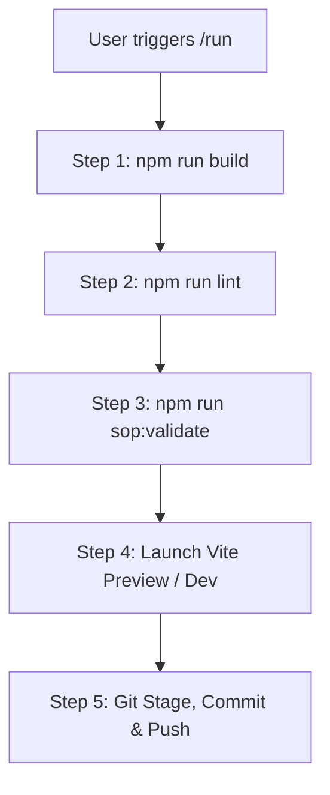

# Standard Workflow: Application Run (`/run`)

## Overview

The `/run` command provides an end-to-end automated pipeline for building, validating, testing, and previewing the Formula 1 Management Simulator.

---

## Workflow Steps



### Step 1: Production Bundle Compilation

```bash
npm run build
```

- Compiles TypeScript schemas, 3D graphics rigs (`createF1Car.ts`, `createPitCrew.ts`), and Web Worker physics engines.
- Outputs distribution assets into `/docs` for GitHub Pages.

### Step 2: Code Quality & Lint Audit

```bash
npm run lint
```

- Analyzes React 18 hooks, TypeScript type safety, and imports.

### Step 3: Governance Verification

```bash
npm run sop:validate
```

- Verifies `.master/MasterChangeLog.md`, `.master/TroubleshootingLog.md`, `.master/IdeasLog.md`, and `.master/FileManifest.md`.

### Step 4: Preview Server Launch

```bash
npm run run:local
# OR
npm run preview
```

- Spawns the local web server on port `5173` / `4173`.

### Step 5: Git Repository Synchronization

```bash
git add .
git commit -m "feat(core): Build R8 update"
git push
```

- Updates remote repository with all source code, assets, documentation, and build bundles.
